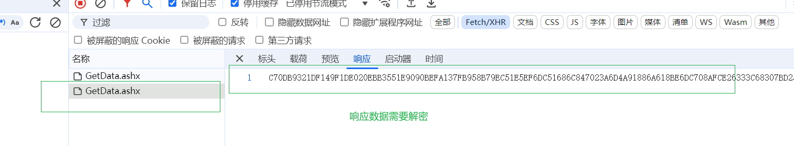
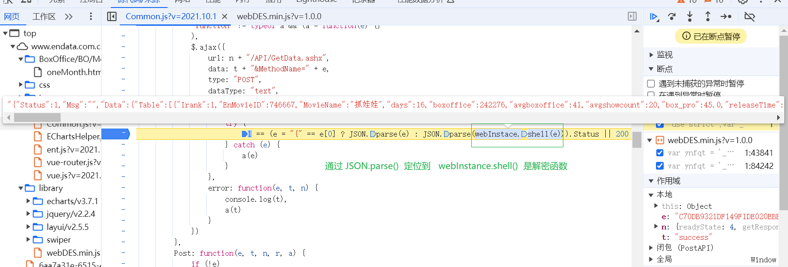
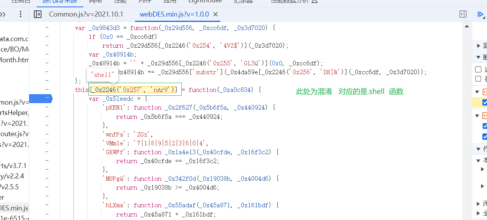
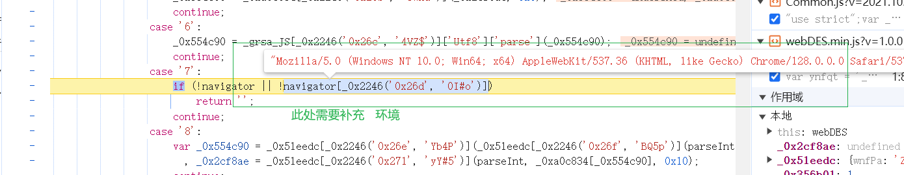
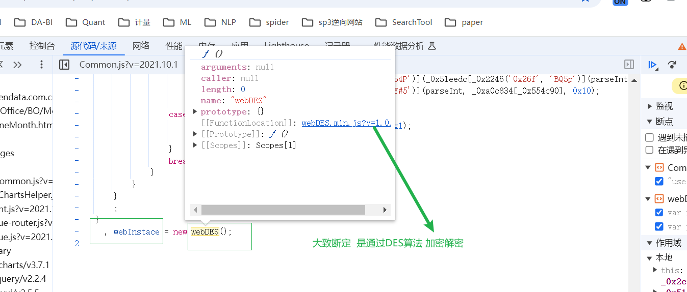

# 1、响应数据解密DES

# 2、解密过程混淆

完成基本解密 之后 调试发现需要  补充环境    userAgent

~~~javascript
//补环境
navigator = {
    userAgent: 'Mozilla/5.0 (Windows NT 10.0; WOW64) AppleWebKit/537.36 (KHTML, like Gecko) Chrome/71.0.3578.98 Safari/537.36'
}
~~~

因为是混淆情况下，不方便使用  crypto-js构造解密方法，可以直接copy 混淆的代码 进行执行
